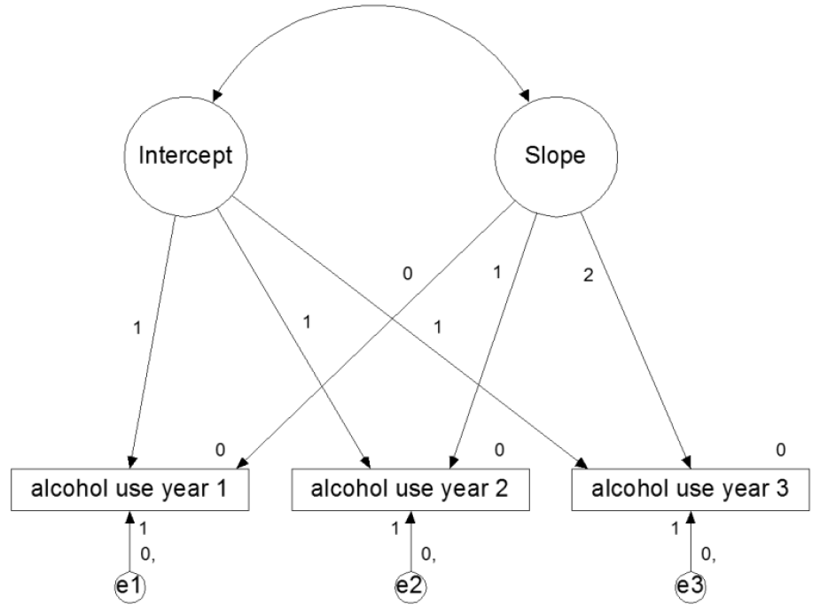

# Day 2: Latent growth curve modeling (LGCM)

In this computer lab session you can practice with specifying latent growth models in Mplus and interpreting the output. All of the input files for the exercises described in this GitBook are provided with the course materials on SURFdrive.

## Exercise 1: Burn survivors

The file `PTSD.dat` contains data on burn survivors, specifically: 

- gender (`gender`), 
- percentage total body surface burned (`tvlo`), 
- SVL at wave 1 (2 weeks after burn injury; `W1`),
- SVL at wave 2 (4 weeks after burn injury; `W2`),
- SVL at wave 3 (2 months after burn injury; `W3`),
- SVL at wave 4 (4 months after burn injury; `W4`),
- SVL at wave 5 (6 months after burn injury; `W5`),
- SVL at wave 6 (9 months after burn injury; `W6`),
- SVL at wave 7 (12 months after burn injury; `W7`),
- SVL at wave 8 (18 months after burn injury; `W8`), and
- BPAS at wave 9 (24 months after burn injury; `pain`), 

in this order.

### Exercise 1a: Specifying a LGCM

Specify a latent growth curve model. Consider different specifications discussed in the lecture, and try to find the best specification. Use only the time measurements, not including additional predictor variables. Think about which metric of time to use and the shape of the function (linear or quadratic). Base your decision of the best model on plots (!), model fit indices, model comparison tools, and interpretation of the model parameters.

If you have reason to believe that another type of LGCM fits the data better, feel free to specific and estimate that model.

<details>

<summary>

<b>Click to show answers</b>

</summary>

**Deciding on the metric of time**

Based on these descriptions, I've chosen for the following specification of time in the LGM:

`i s | W1@0.5 W2@1 W3@2 W4@4 W5@6 W6@9 W7@12 W8@18;`

In this specification I set the first time point to 0.5 months after burn injury (approximation of 2 weeks after burn injury), the second time point to 1 month after burn injury (approximation of 4 weeks after burn injury), etc.

**Plots** 
You can enable the plot functionality of Mplus by specifying 

```
PLOT:
  TYPE = PLOT3;
  SERIES = W1 W2 W3 W4 W5 W6 W7 W8 (s);
```

The `TYPE = PLOT3;` function ensures that all kinds of different types of plots are available in Mplus (see the Mplus User Guide for an overview of the different types of plots). The `SERIES = ...;` function tells Mplus to draw a line through the named variables in that order, for each individual.

EXPLAIN HOW TO GET NATIVE PLOTS OF MPLUS AND SHOW THEM HERE.

**Deciding on linear vs. linear and quadratic slope** 

Some example syntaxes for running models with different trajectory shapes are available in SURFdrive. These include:

1. A LGCM with only a linear slope.
2. A LGCM with an added quadratic slope.
3. A LGCM with an added quadratic slope but no quadratic slope factor variance.

For the model with a quadratic slope, it was necessary to fix the variance of Q at 0 to ensure convergence. For both models, only CFI and TLI indicate adequate fit.

| Model      | Parameters |  AIC  |  BIC  | RMSEA | CFI | TLI | SRMR |
|:-----------|:----------:|:-----:|:-----:|:-----:|:---:|:---:|:----:|
| exercise1a.out |     13     | 14051 | 14096 |  .14  | .93 | .94 | .08  |
| exercise1a_Q.out   |     \-     |  \-   |  \-   |  \-   | \-  | \-  |  \-  |
| exercise1a_Q0.out  |     14     | 14037 | 14085 |  .13  | .94 | .94 | .08  |

**Model comparison tools** 

To see which model fit the data better, we can do a $\Delta \chi^{2}$ (i.e., Chi-square difference) test (e.g., using the function `chisq_sb()` from the `tidySEM` package in R, or using on online $\chi^{2} calculator$): $\Delta \chi^{2} = 16.14$, $\Delta df = 1$, $p < .001$. Furthermore, both AIC and BIC are lower in the model with a quadratic slope. Thus, model misfit is significantly lower when the quadratic slope is added although the fit indices still do not indicate adequate fit. We can use the plots, `RES` option in Mplus, or modification indices to see what the source of the misfit is.

**Model parameters** 

The mean of the quadratic slope factor is significant (`q = 0.02`, $p < .001$), indicating that, on average, the growth curve does follow a quadratic curve (see `exercise1a_Q0.out`).

`r if(knitr::is_html_output()){"\\details"}`

### Exercise 1b: Adding covariates

Using the best fitting LGM model found above, regress the growth parameters on `TVLO` and regress `pain` on the growth components. Then investigate if there are gender differences in the regression of the growth parameters on `TVLO` and in the regression of `pain` on the growth parameters?

<details>

<summary>

<b>Click to show answers</b>

</summary>

Rephrasing the question, we are asked to investigate if gender moderates the predictive relationship of `TVLO` on the growth components, as well as the relationship between the growth components and `Pain`. As such, we can do a multigroup analysis by gender, resulting in the addition of the following syntax to the `VARIABLE:` command:

`GROUPING = gender (1 = male 2 = female);`

Since we needed to fix the quadratic slope variance to 0, we cannot estimate any regressions on the quadratic slope or use the quadratic slope as a predictor of some outcome. We therefore focus on the intercept and linear slope.

The file `exercise1B.inp` on SURFdrive contains the Mplus syntax on how to specify this model, including the `MODEL TEST` command to test between-group (i.e., between-gender) differences in the effect of `TVLO` on the growth components, and the growth components on `pain`. This is only an illustrative example for how to approach this analysis; your specific execution may differ (e.g., you could specify 2 models, and with across group constraints and one without, and then use the $\Delta \chi^{2}$ test to see if the improvement of model fit is significant). Note that in this example, the Wald $\chi^2$ p-value is not significant. That means that there are no significant gender differences in the effect of the growth trajectory on pain.

Note that the Wald test is an overall test of **all** comparisons that we specify in `MODEL TEST`. Thus, if you want a separate test for the regression of TVLO on the growth parameters, you need to re-run the analysis but with a different `MODEL TEST` argument.

Conclusion: There are no gender differences in the regression of growth parameters on TVLO and in the regression of Pain on the growth parameters.

`r if(knitr::is_html_output()){"\\details"}`

## Exercise 2: Alcohol use

The figure below depicts the basic LGCM for the alcohol use data from Duncan, Duncan, and Strycker (2006), example 8_1. 

{width="400px"}

The data are in the file `DDS8_1.dat`, with variables `ALC1YR1` `ALC1YR2` `ALC1YR3` `ALCPROB5` `AGE1` and `GENDER1` (in that order). Missing values are coded as `-99`. The variable `ALCPROB5` is categorical, it indicates alcohol problems in year 5 of the study (0 = no, 1 = yes).

### Exercise 2a: Specify a LGCM

Set up the LGCM as depicted in the figure above in Mplus using the `|` notation (rather than specifying a CFA by using the `BY` statement). Inspect the output carefully with special attention for a) the pattern of missing values, b) the model fit, and c) the interpretation of the parameter estimates. How well does the model predict alcohol use of the years? 

<details>

<summary>

<b>Click to show answers</b>

</summary>

The input and output file (`exercise2A.inp` and `exercise2A.out`) can be found on SURFdrive. The table under `PROPORTION OF DATA PRESENT` in the output file shows that the majority of the cases is complete, but that there is a small amount of attrition (panel dropout). You can also inspect the coverage matrix to inspect how much information you have for different parts of the model. Regarding model fit, the model fits well overall with the chi-square test of model fit $\chi^{2}(1) = 2.781$, $p = 0.095$, and the CFI and TLI above their recommended cutoff points. However, the RMSEA implies some some degree of misfit at $0.062$. The intercept and slope means indicate a relatively high starting point (3.68, $SE = .081$) and a growth of 0.92 ($SE = .053$) per year. The intercept and slope factors show considerable variance, indicating that the starting points and rates of growth differ considerably across individuals. Interestingly, the explained variance $R^{2}$ is high for years 1 and 3, but lower for year 2. 

`r if(knitr::is_html_output()){"\\details"}`

### Exercise 2b: Predicting growth 

We will now *explore* how different predictor variables affect the model fit. Include gender and age in the model as predictors of the intercept and slope. Interpret the fit of the model and the output. Feel free to estimate several models, including or excluding certain covariates. Make a model fit table by hand in a spreadsheet, reporting on the fit indices you deem to be appropriate. Which model do you consider to be best?

#### Exploratory vs confirmatory research

Note that when you conduct *confirmatory* research, and are testing theoretical hypotheses, you should not add and omit paths based on exploratory analyses and model fit. It is fine to add and remove paths in *exploratory* research. Model fit indices, like AIC and BIC, are suitable for selecting well-fitting models in exploratory research. p-values are not designed for variable selection, and using them for that purpose may lead to sub-optimal models.

It is good scientific practice to clearly separate confirmatory and exploratory research. When you conduct exploratory research, you should not perform inference on the resulting parameters based on p-values (because inference generalizes your findings to the population, and exploratory findings tend to be tailored toward this specific sample). You should also not present exploratory results as if they were testing a post-hoc theory (also referred to as "Hypothesizing After the Results are Known", or *HARKing*). This is a questionable research practice and can lead to false-positive (spurious) findings.

<details>

<summary>

<b>Click to show answers</b>

</summary>

The files `exercise2B_M1.inp`, `exercise2B_M2.inp`, and `exercise2B_M3.inp`, on SURFdrive contain various models in which we predict the growth components using `AGE1` and `GENDER1`. The model fit remains excellent. After removing non-significant paths from `exercise2B_M1.inp` (order based on magnitude of standardized effect size), gender and age only predict the starting point but not the slope. However, after having removed the effect of gender and age on the slope, the model suddenly fits very badly (`exercise2B_M2.inp`). Careful inspection of the output shows that the covariance between intercept and slope has disappeared from the model (it is now the covariance between a latent variable and a residual, Mplus automatically puts these at zero). Mplus automatically constrains these to zero. If we add the statement `I WITH S` to the model, we obtain a good fit with significant effects of both gender and age on the intercept (`exercise2B_M3.inp`). This illustrates the importance of checking the output carefully to find out if Mplus is actually doing what you think it does!

`r if(knitr::is_html_output()){"\\details"}`

### Exercise 2c: Categorical distal outcome

Include alcohol problems in year 5 in the model. Let the intercept and slope factors predict alcohol problems in year 5. Declare the variable as categorical in the variable section (`CATEGORICAL = ALCPROB5`). Inspect if the effect of age and gender on alcohol problems year 5 is completely mediated by the growth factors, or if there are additional direct paths from age and gender on the alcohol problems.

<details>

<summary>

<b>Click to show answers</b>

</summary>

The model fit is still good. Note that after adding a categorical dependent variable to the model, Mplus switches to a robust estimator (MLR, and the exact type of regression the Mplus uses now is a logit regression). Both intercept and slope predict alcohol problems (see `exercise2c_M1.inp` on SURFdrive). Age also predicts alcohol problems directly (see `exercise2c_M2.inp` on SURFdrive). Since age predicts alcohol problems both directly and via the intercept, a mediation analysis is in order. This shows that the indirect effect of age via the intercept on alcohol problems is still significant when the direct effect is added to the model. 

`r if(knitr::is_html_output()){"\\details"}`

## Exercise 3: Level and shape parameterization

The file `GPA.dat` holds the following variables (in that order):

- grade point average (GPA) data with GPA scores of 200 students in 6 consecutive semesters (`gpa1`, ..., `gpa6`)
- high school GPA `highpa`
- gender `sex`
- admitted to university of choice (missing if not applied for university, `student`)

In this exercise you will use the GPA data to set up a level and shape model (i.e., a LGCM with estimated time scores).

### Exercise 3a

Use a parameterization with `GPA1@0` and `GPA6@1`. The loadings for the other time points should be freely estimated. This can be done with, for example, the syntax `GPA2*` as shown in the handout. Interpret the factor loadings and estimate for `S`.

<details>

<summary>

<b>Click to show answers</b>

</summary>

The Mplus model syntax for this LGCM can be found in `exercise3A.inp` on SURFdrive. The factor loadings indicate the proportion of change for a 1 unit change in time (here, a 1 unit change of time is specified as the change between the first and the last time points). The predicted change in the outcome for a 1 unit change in time is the mean of the slope, $\alpha_{S} = 0.55$. Therefore, when looking at the factor loadings, 24% of the total change occurs between `GPA1` and `GPA2.`. The intercept at `GPA1` = 2.575. So the estimated score at `GPA2` is $GPA1 = 2.575 + 0.239*0.549 = 2.706$. The estimated score at `GPA3` is $GPA3 = 2.575 + 0.450*0.549 = 2.822$, etc.

`r if(knitr::is_html_output()){"\\details"}`

### Exercise 3b

Now use a parameterization with `GPA1@0` and `GPA2@1`. The other GPA's should be freely estimated. Interpret the factor loadings and estimate for S.

<details>

<summary>

<b>Click to show answers</b>

</summary>

The Mplus model syntax for this parametrization of the LGCM with freely estimated time scores can be found in `exercise3B.inp`. The mean of the slope factor $\alpha_{S}$ now indicates the difference between `GPA1` and `GPA2`. The estimated factor loadings indicate the distance in units from the starting point, where 1 unit is S. In other words, every distance compares to the increase between GPA1 and GPA2.

`r if(knitr::is_html_output()){"\\details"}`

Which parameterization do you like best?

### Exercise 3c

Draw the development of GPA over time, using the parametrization of your choice) based on your own calculations (by hand). Compare this to the estimated means plot that you can get with the plot command: 

```
PLOT: 
  SERIES = GPA1-GPA6 (s); 
  TYPE = PLOT3;
```

Don't forget that you need to rescale that plot, since `S` is linear while the location of the estimated points is based on the factor loadings.

<details>

<summary>

<b>Click to show answers</b>

</summary>

The estimated means plot for the parametrization (0 1 * * * *) is shown below, and can be generated by clicking the plots button, and selecting "Estimated means". 

{width="400px"}

`r if(knitr::is_html_output()){"\\details"}`

### Exercise 3d

Use sex as a predictor of the intercept and slope and interpret the result (with 0 = boys, 1 = girls).

<details>

<summary>

<b>Click to show answers</b>

</summary>

The Mplus model syntax for the LGCM with time scores (0 * * * * 1) and gender predicting the growth components can be found in `exercise3D.inp`. Sex is a significant predictor of the intercept and a significant predictor of development, with girls having a higher initial level ($b = .079$, $SE = .037$), and a greater development over time ($b = .136$, $SE = .054$). Who run the world?

`r if(knitr::is_html_output()){"\\details"}`

## Exercise 4: Latent growth curve model on GPA data

### Exercise 4a

Continuing with the data used for the previous exercise, set up a latent growth model for GPA for the 6 consecutive occasions and run this model. Obtain the following parameters:

-   AIC, BIC, $\chi^{2}$, RMSEA, CFI, and TLI;
-   The mean of the intercept factor $\alpha_{I}$ and slope factor $\alpha_{S}$;
-   The variance of the intercept facor $\psi_{I}$ and slope factor $\psi_{S}$.

<details>

<summary>

<b>Click to show answers</b>

</summary>

The Mplus model syntax for this can be found in `exercise4A.inp`. 

`r if(knitr::is_html_output()){"\\details"}`

### Exercise 4b

Then, set up a latent growth curve model for 3 years where each year is a latent variable measured by the GPA of two consecutive semesters.

The factor loadings for GPA2, GPA4 and GPA6 ought to be constrained to be equal with a label (a) behind the loading in the syntax. As such, the scores relate in the same way to the year score over time. The GPA intercepts are constrained at 0.

If you get the error message below, can you find out what the problem is?

```
WARNING:  THE LATENT VARIABLE COVARIANCE MATRIX (PSI) IS NOT POSITIVE DEFINITE. THIS 
COULD INDICATE A NEGATIVE VARIANCE/RESIDUAL VARIANCE FOR A LATENT VARIABLE, A CORRELATION 
GREATER OR EQUAL TO ONE BETWEEN TWO LATENT VARIABLES, OR A LINEAR DEPENDENCY AMONG MORE 
THAN TWO LATENT VARIABLES. CHECK THE TECH4 OUTPUT FOR MORE INFORMATION. 
```

A rough way to deal with this problem may be to fix the problematic parameter to a particular value (e.g., .001), try this and rerun the model. Now examine the same parameters as for exercise 4a, and compare the two. Are there major differences?

<details>

<summary>

<b>Click to show answers</b>

</summary>

The Mplus model syntax for this can be found in `exercise4B_M2.inp`. Note that, without `year3@.001` (see `exercise4B_M1.inp`), this code gives an error message: The variance of the latent variable year3 is estimated negatively which is problematic since variances should always be positive. A simple way to deal with the problem of the latent variance of year3 is to fix it to a very small value (.001) for instance, as it would also be illogical to fix a variance to 0. To do this, simply add this to your input file under model: `year3@.001;`

If you inspect the output carefully (and provided you have requested standardized estimates) you will notice that the latent variables `year2` and `year3` have a correlation of 1. So the negative variance is the result of a multicolinearity problem. It is apparently better to analyze these data using only the observed variables `gpa1-gpa6`. Creating latent variables per year does not work well. In line with this interpretation, the fit and results of the simple latent growth model look better than the 2nd order latent growth curve model.

`r if(knitr::is_html_output()){"\\details"}`
