<style>
.answer {
  background-color:#f5fcfb;
  color: #005c4f;
  border: 2px solid black;
  margin: 20px;
  padding: 20px;
}
</style>
---

# Day 5: Dynamic SEM (DSEM)

In this exercise we focus on analysing intensive longitudinal data (ILD) obtained with experience sampling (also referred to as ecological momentary assessments).

We will use data from Bringmann et al. (2013), stored in file `Bringmann1.dat`. It contains data from 129 persons, with each between 20 to 60 repeated measurements per variable. Throughout these exercises we will focus on two variables: Somber (to what degree are you feeling somber right now?), and Event (report on the most important event since the previous beep and indicate how unpleasant-pleasant is was). 

<span style="font-size:.8em;"> Bringmann, L. F., Vissers, N., Wichers, M., Geschwind, N., Kuppens, P., Peeters, F., ... & Tuerlinckx, F. (2013). A network approach to psychopathology: new insights into clinical longitudinal data. PloS one, 8(4), e60188.</span>

## Random Intercept Model with Implicit Lagged Effects (not DSEM)

In Model 1 we first decompose each variable at each time point (occasion) in two parts: 

* a person-specific mean, which has the same value at each occasion but differs from person to person
* a deviation from that mean for each person and occasion.

Hence, we decompose the variables into two latent variables: One with person-specific means, at the <i>between level</i>. One with deviations from these means unique to each occasion and person, at the <i>within level</i>. These deviations can be seen as simply the within-person centered scores for a person at each occasion.

Next, we add two regression relationships:

* Between level: the person means of Somber are regressed on the person means of Event 
* Within level: the person-mean centered variable Somber is regressed on the person-mean centered variable Event.

Note that this is not a dynamic SEM model yet in terms of the Mplus specification, because there are <i>no explicit lagged relationships</i> in the model. But note that there is an <i>implicit lagged relationship</i>: Although the two variables are measured at the same occasion (as indicated by the subscript t), the variable Event refers to the interval between t-1 and t, while the variable Somber is referring to the specific time point t. Hence, the reported on events take place <i>before</i> the somber feelings.

This model can be represented as depicted below, with on the left this decomposition, and on the right the regression models specified at each level.

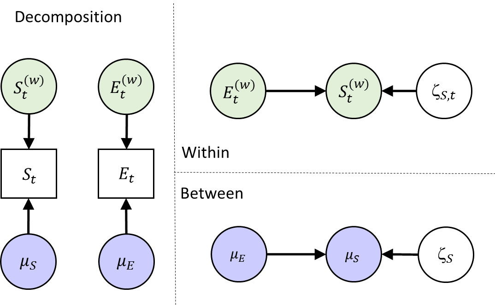{width="400px"}


### Specify the Mplus Model

To run this model, use the input file `model1.inp`. In the ANALYSIS command you will find a number of commands that set up the Bayesian multilevel estimation procedure:

```
ANALYSIS:   TYPE = TWOLEVEL;
            ESTIMATOR = BAYES; 
            PROC = 2;
            BITER= (2000);
            BSEED = 9556;
```
Make sure the following commands for OUTPUT and PLOT are included:

```
OUTPUT:     TECH1 STDYX;
PLOT:       TYPE = PLOT3;
            FACTORS = ALL;
```        

Check out the model specification (i.e., the MODEL command). What do the commands on the within person level and on the between person level do?

<details>
  <summary><b>Click to show answers</b></summary>
<div class="answer">  
Via ‘Somber ON Event’ at the within level, for each person in the model their somber within-person centered scores are regressed on their within-person centered event scores on the same measurement occasion. The regression coefficients and other model parameters – except for the means of somber and event -  are the same for all persons.

Via ‘Event’ we tell Mplus to make Event endogenous like Somber, such that means and variances are estimated for this variable as well - and Event is decomposed in a between person level and within-person level as well. That is, for both Somber and Event we now estimate the mean score over time for each individual inside the model. On the within level the deviations from these means (within-person centered scores) at each time point are modeled. At the between level the relationships among these means, that vary from individual to individual, are modeled.

Via ‘Somber ON Event’ at the between level, it is specified that the person-specific means for Somber are regressed on the person-specific means for Event.
</div>

`r if(knitr::is_html_output()){"\\details"}`
</details>

### Model Equations & Parameters

While the model is running, write down the model in equations. 

* Start with the decomposition, i.e., $E_{it}=$ ...

<details>
  <summary><b>Click to show answers</b></summary>
<div class="answer">   
  $$S_{it} = \mu_{S i} + S_{it}^{(w)}$$
  $$E_{it} = \mu_{E i} + E_{it}^{(w)}$$
  
  `r if(knitr::is_html_output()){"\\details"}`
  </div>
</details>

* Write down the within level model. Which parameters are estimated at this level?

<details>
  <summary><b>Click to show answers</b></summary>
  <div class="answer"> 
  $$S_{it}^{(w)} = b \times E_{it}^{(w)} + \zeta_{S it}$$
Parameters estimated at this level:

*	Fixed within-person slope b (same for each person)
*	Residual within-person variance for S, the variance of $\zeta_Sit$
*	Within-person variance of the (made endogenous) predictor $E^{(w)}_{it}$
</div>

  `r if(knitr::is_html_output()){"\\details"}`
</details>

* Write down the between level model. Which parameters are estimated at this level?

<details>
  <summary><b>Click to show answers</b></summary>
<div class="answer">   
  $$\mu_{S i} = \gamma_{00} + \gamma_{01} \times \mu_{Ei} + \zeta_{Si} $$
Parameters estimated at this level:

*	Grand intercept $\gamma_{00}$
*	Between-person slope $\gamma_{01}$
*	Between-person residual variance of $\zeta_{Si}$
*	Mean of the between-person predictor $\mu_{Ei}$
*	Variance of the between-person predictor $\mu_{Ei}$
</div>
  
  `r if(knitr::is_html_output()){"\\details"}`
</details>

### Convergence

When the model is finished running, we first need to check the trace plots of the Bayesian estimation procedure to see if there are signs for non-convergence. Go to the icon with the two graphs, and click on this. Then, choose the option “Bayesian posterior parameter trace plots” and click “View”.

{width="400px"}

By clicking “OK” in the next window, the trace plot of parameter 1 appears. You can use the icons with the histograms and the left and right headed arrows to move backward and forward through the parameters (their names are in the headings of the plots). 

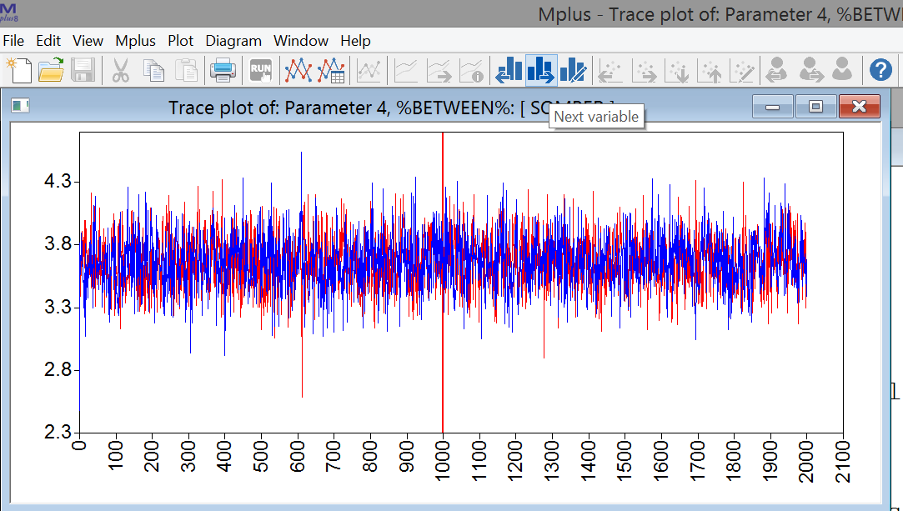{width="400px"}

Write down how these parameters relate to the ones you identified above (in questions c. and d.), 

Are there any problems with convergence based on these plots? Can you tell what parameter from question b each plot is about? 

<details>
  <summary><b>Click to show answers</b></summary>
<div class="answer"> 

* Parameter 1, %WITHIN%: SOMBER ON EVENT &rarr; within-person regression coefficient b
* Parameter 2, %WITHIN%: SOMBER &rarr; within-person residual variance for somber
* Parameter 3, %WITHIN%: EVENT &rarr; within-person variance on Event
* Parameter 4, %BETWEEN%: [SOMBER] &rarr; between-person intercept on Somber ($\gamma_{00}$)
* Parameter 5, %BETWEEN%: [EVENT] &rarr; between-person mean on Event
* Parameter 6, %BETWEEN%: SOMBER ON EVENT &rarr; between-person regression coefficient ($\gamma_{01}$)
* Parameter 7, %BETWEEN%: SOMBER &rarr; between-person residual variance of somber
* Parameter 8, %BETWEEN%: EVENT &rarr; between-person variance on Event 

Convergence looks fine for the parameters.

</div>

  `r if(knitr::is_html_output()){"\\details"}`
</details>

### Interpret the Results

Go to the output, and consider the parameter estimates. Interpret the findings for the within-person and the between-person slopes (e.g., do they differ from zero, are they positive or negative, what about their size?). 

<details>
  <summary><b>Click to show answers</b></summary>
<div class="answer"> 
```
Within Level

 SOMBER     ON
    EVENT             -0.203       0.010      0.000      -0.223      -0.184      *


Between Level

 SOMBER     ON
    EVENT             -0.953       0.159      0.000      -1.266      -0.651      *
```

Both slopes are negative, implying that:

* Within person:	People's increased (relative to their mean level) Event scoretends to be followed by a decreased (relative to their mean level) temporary somberness score. A 1 unit higher event score tends to be followed by a decrease of .20 units in their somber score.
* Between person: People a relatively high (compared to other people) mean for event, tend to have a relatively low (compared to other people) mean for somberness. A 1 unit higher mean would imply about a .95 units lower mean for Somber.

The between-person slope is more than 4 times steeper: Note however that the between-person variance in Event is about 10 times smaller than the within-person variance in Event (0.278 vs. 2.844). Hence, in the next step we look at the standardized results.
</div>

  `r if(knitr::is_html_output()){"\\details"}`
</details>

### Standardized Results

Check the standardized results to compare the size of the slopes within and between. 

<details>
  <summary><b>Click to show answers</b></summary>
<div class="answer">   
```
SOMBER     ON
    EVENT             -0.259       0.012      0.000      -0.284      -0.236      *

SOMBER     ON
    EVENT             -0.529       0.074      0.000      -0.656      -0.374      *
```

The standardized between slope is more than twice as steep than the within slope. 

In terms of $R^{2}$:

* 6.7% of the momentary within-person variability in Somber is explained by within-person variability in Events. 
* 28.0% of the stable between-person variability in Somber is predicted by between-person differences in average Event. 
</div>
  `r if(knitr::is_html_output()){"\\details"}`
</details>

## Random Intercept and Slopes Model with Implicit Lagged Effects (not DSEM)

In Model 2, we extend Model 1 to allow for individual differences in the within-person slope. This implies that people may respond differently to a temporary increase in the variable Event; this can be interpreted as individual differences in reactivity. This random slope `b1` becomes another latent variable at the between-person level, where we can use it as a predictor of the person-specific means of the variable Somber. We will also allow this slope variable to correlate with the means of Event.

Model 2 can be represented as depicted below, with on the left the within-between decomposition, and on the right the regression models specified at each level. Note the black dot on the arrow to indicate a random slope at the within level.

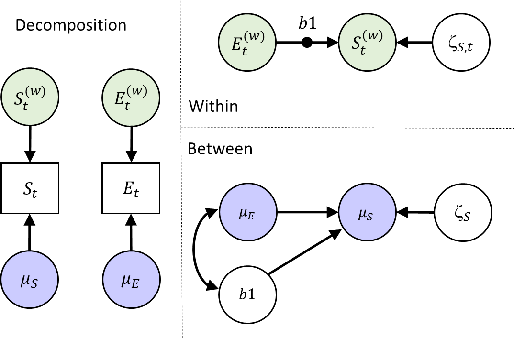{width="400px"}

### Specify the Mplus Model

Write down the model command for this model. When your are done, check whether you specified it correctly by looking at the provided answers, and/or the input file `model2.inp`. Note that under command ‘ANALYSIS’ in the input file, we now need to specify `type = TWOLEVEL RANDOM`.

<details>
  <summary><b>Click to show answers</b></summary>
<div class="answer"> 
``` 
MODEL:  %WITHIN%
              b1 | Somber ON Event;
              Event;  
              %BETWEEN%
              Somber ON Event b1;
	            b1 WITH Event;
```
</div>
  `r if(knitr::is_html_output()){"\\details"}`
</details>


### Model Equations

While the model is running, write down the model equations. The decomposition into within and between will be the same as for Model 1. 

* Write down the within level model. What parameters are estimated at this level?

<details>
  <summary><b>Click to show answers</b></summary>
<div class="answer"> 
$$S^{(w)}_{it}=b_{1i}\times E^{(w)}_{it} + \zeta_{S it}$$
The difference is that now the regression coefficient has a subject index `i`, because it now differs from person to person. The mean and variance of b1i are estimated at the between person level.

Parameters estimated at this level:
-	Residual within-person variance of $\zeta_{Sit}$
-	Within-person variance of the predictor $E^{(w)}_{it}$
</div>
  `r if(knitr::is_html_output()){"\\details"}`
</details>

* Write down the between level model. Which parameters are estimated at this level?

<details>
  <summary><b>Click to show answers</b></summary>
<div class="answer"> 

$$\mu_{Si} = \gamma_{00} + \gamma_{01} \times \mu_{Ei} + \gamma_{02} \times b_{1i} + \zeta_{Si}$$

 Parameters estimated at this level:
 
-	Grand intercept $\gamma_{00}$
-	Between-person slope $\gamma_{01}$
-	Between-person slope $\gamma_{02}$
-	Between-person residual variance of $\zeta_{Si}$
-	Mean of the between-person predictor $\mu_{Ei}$
-	Variance of the between-person predictor $\mu_{Ei}$
-	Mean of the between-person predictor $b_{1i}$ (i.e., within-person slope)
-	Variance of the between-person predictor $b_{1i}$ 
-	Covariance of $b_{1i}$ and $\mu_{Ei}$ (with statement in mplus code)

</div>
  `r if(knitr::is_html_output()){"\\details"}`
</details>

### Convergence

Check the trace plots of the posteriors for the parameters of the model. Can you link them to the free parameters you identified above? Are there signs of non-convergence?

<details>
  <summary><b>Click to show answers</b></summary>
<div class="answer"> 
All looks good. 
</div> 
  `r if(knitr::is_html_output()){"\\details"}`
</details>

### Interpret the Results

* Which parameter is the one we should focus on when interested in the average of the person-specific within-person slopes b1? 

<details>
  <summary><b>Click to show answers</b></summary>
 <div class="answer">  
```
Between Level

Means
    B1                -0.206       0.014      0.000      -0.234      -0.179      *
```

It is the mean B1 reported at the between level.

</div>
  `r if(knitr::is_html_output()){"\\details"}`
</details>

* There are two ON statements at the between level now. Report the results for these regressions, and indicate how to interpret these results.

<details>
  <summary><b>Click to show answers</b></summary>
<div class="answer"> 
```
Between Level

SOMBER     ON
    B1                -1.966       1.079      0.020      -4.366      -0.095      *

 SOMBER     ON
    EVENT             -0.839       0.176      0.000      -1.188      -0.490      *
```

As before: People with a relatively high (compared to other people) mean for event, tend to have a relatively low (compared to other people) mean for somberness.

In addition: People that have a relatively low mean for somber (compared to other people), tend to have a lower within-person slope b1. 

</div>
  `r if(knitr::is_html_output()){"\\details"}`
</details>

  * Interpreting the effect of b1 on Somber is challenging for most people. What may be helpful is to make a plot of the (bivariate) relationship between b_1i and the within-person mean on somber.  
  
  <details>
  <summary><b>Click for instructions</b></summary>
<div class="answer"> 
Go  to the plotting options and choose “Between-level scatterplots…” 

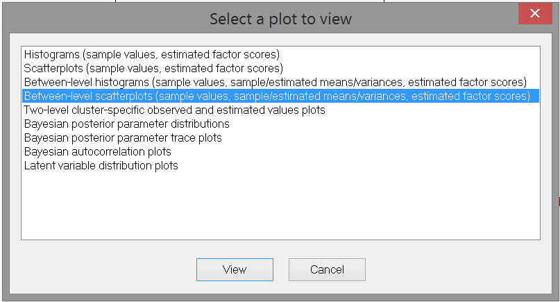{width="400px"}

Click View. Then select “B1, mean” (the posterior means of each person’s B1 coefficient) as the X variable and “SOMBER (estimated cluster mean)” (each person’s mean for Somber) as the Y variable:

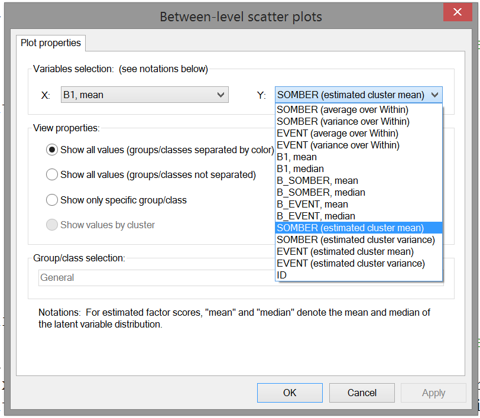{width="400px"}

Click OK. This produces the scatter plot. 
</div>
  `r if(knitr::is_html_output()){"\\details"}`
</details>

  * Interpret the relationship you see in the scatterplot.

<details>
  <summary><b>Click to show answers</b></summary>
<div class="answer"> 
{width="400px"}

The correlation is negative (about -0.503), indicating that a higher b1 (within-person slope) tends to go together with a lower person-mean on somber. 

Note that the individual differences in b1 run from -0.5 to about 0. Hence, the closer b_1i is to zero, the lower the person’s average score on somber. 

Put differently, people who tend to be less reactive to momentary changes in Events (b_1i closer to zero), are also characterized by a lower trait score on somber.  

Note that this plot is just presenting the bivariate relationship between the two random effects; in contrast, the regression coefficient in the output also is based on a regression model with multiple predictors (in this case, also the person mean on Event). Hence the scatter plot may be helpful, but is not a direct reflection of the regression coefficient (this is the same as in normal multiple linear regression analysis).
</div>

  `r if(knitr::is_html_output()){"\\details"}`
</details>
 

  
* Let us look at the person-specific slopes (the random effect b1) that were estimated. 

<details>
  <summary><b>Click for instructions</b></summary>
  <div class="answer"> 
To this end, go to the plot menu again and choose the option “Two-level cluster-specific observed and estimated values plots”. Click “View”, and click “OK” in the next window: Now you have a scatter plot of the data of a single individual, with the variable Event on the x-axis and Somber on the between-axis. The slope of the red line is the individual’s b1 (the individual specific regression coefficient for regressing Somber on Event).

To fix the axes (which makes it easier to compare the results across individuals, go to the plot menu at the top, choose “Axis properties” and then “Edit settings”:

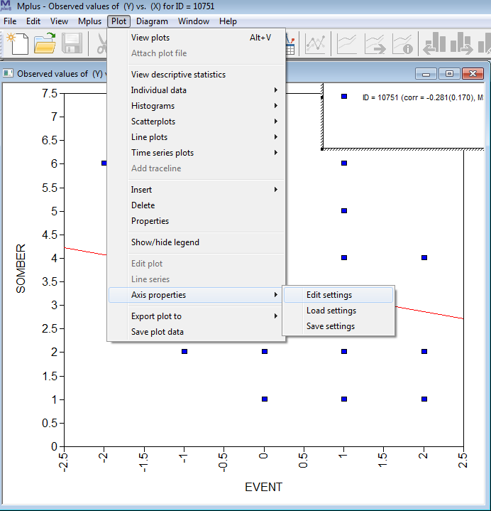{width="400px"}

In the next window, choose the “Axes Range” tab, click the “Fixed scale” option (at the top), and set the scale range for X from -4 to 4 (because Event was measured on a scale running from -3 to 3), and set the scale of Y from 0 to 8 (because it was measured on a scale from 0 to 7). Then click “OK”. 

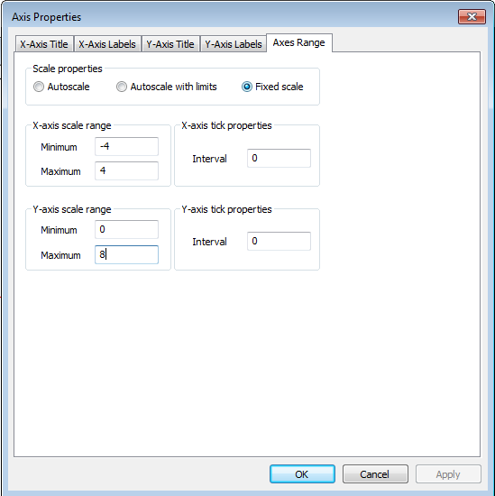{width="400px"}

Now, you can go through the plots of different individuals by clicking the person buttons on the top (with the left arrow to go back, and the right arrow to go forward). Because you fixed the axes, you can easily compare the slopes for different people. This illustrates that every person has his/her own slope. 
</div>
  `r if(knitr::is_html_output()){"\\details"}`
</details>


## Dynamic SEM - including random autoregressive effects.

Next, we include a dynamic relationship in our model. First, create a lagged version of Somber, by using the `LAGGED = ` in the `VARIABLE` command). In the next step, we'll include the lagged variable as a predictor at the within level, allowing for a random slope - this produces a random autoregressive effect (each individual will get their own autoregressive effect). This model can be represented as:

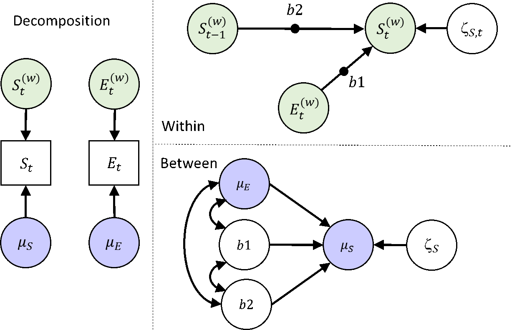{width="400px"}

### Specify the Mplus Model 

Write out the model command for this model. Check with the input file `model3.inp` if you specified it correctly.

<details>
  <summary><b>Click to show answers</b></summary>
  
<div class="answer"> 
```
MODEL:
            %WITHIN%
            s1 | Somber ON Event; ! random regression
            s2 | Somber ON somber&1; ! random autoregression 
            
            %BETWEEN%
            Somber ON Event s1 s2;
```
 The command `&1` attached to a variable indicates this should be a lag 1 variable. The parameter label followed by `|` produces a random effect like before.

</div>
  `r if(knitr::is_html_output()){"\\details"}`
</details>

### Model Equations

While the model is running, write down the model equations.

* Write down the within level model. What parameters are estimated at this level?

<details>
  <summary><b>Click to show answers</b></summary>
  <div class="answer"> 

$$S^{(w)}_{it}=b_{1i}\times E^{(w)}_{it} + b_{2i}\times S^{(w)}_{it-1} + \zeta_{S it}$$

Parameters estimated at this level:

-	Residual within-person variance of $\zeta_{Sit}$
-	Within-person variance of the predictor $E^{(w)}_{it}$

</div>
  `r if(knitr::is_html_output()){"\\details"}`
</details>

* Write down the between level model. Which parameters are estimated at this level?

<details>
  <summary><b>Click to show answers</b></summary>
<div class="answer"> 

$$\mu_{Si} = \gamma_{00} + \gamma_{01} \times \mu_{Ei} + \gamma_{02} \times b_{1i} + \gamma_{03} \times b_{2i} + \zeta_{Si}$$

 Parameters estimated at this level:
 
-	Grand intercept $\gamma_{00}$
-	Between-person slope $\gamma_{01}$
-	Between-person slope $\gamma_{02}$
-	Between-person slope $\gamma_{03}$
-	Between-person residual variance of $\zeta_{Si}$
-	Mean of the between-person predictor $\mu_{Ei}$
-	Variance of the between-person predictor $\mu_{Ei}$
-	Mean of the between-person predictor $b_{1i}$ (i.e., within-person slope)
-	Variance of the between-person predictor $b_{1i}$ 
-	Mean of the between-person predictor $b_{2}$ (i.e., autoregressive slope)
-	Variance of the between-person predictor $b_{2i}$ 
-	Covariances between $b_{1i}$, $b_{2i}$, and $\mu_{Ei}$
</div>
  `r if(knitr::is_html_output()){"\\details"}`
</details>

### Convergence & Interpret the Results

* Again, check the trace plots. If they look okay, consider the parameter estimates. What can you say about the autoregressive effects?

<details>
  <summary><b>Click to show answers</b></summary>
  
 <div class="answer">  
```
Means
    B2                 0.340       0.022      0.000       0.300       0.383      *

Variances
    B2                 0.031       0.007      0.000       0.020       0.047      *
```

The average autoregressive effect is 0.34, with SD=0.18 (=`sqrt(0.031)`). On average, about .34 of the previous Somber score carries over to the next Somber score. The actual autoregressive effects will however differ from person to person.

Hence, on average across persons, about 12% (`0.34^2`=.12) of the within-person variability in somberness is predicted by the autoregressive effect. The exact numbers will however differ from person to person.

</div>
  `r if(knitr::is_html_output()){"\\details"}`
</details>

  * To obtain some idea of the individual differences in the autoregressive parameter, we will consider diverse plots. One plot that might be of interest is the histogram of the individual parameter values. 
  
  <details>
  <summary><b>Click for instructions</b></summary>
 <div class="answer">  
Again, go to the plotting options, and now select the option: Between-level histogram (etc.) 
  
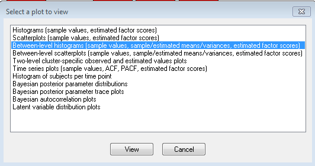{width="400px"}
  
Click View. In the next window, select the random autoregressive parameter (B2):

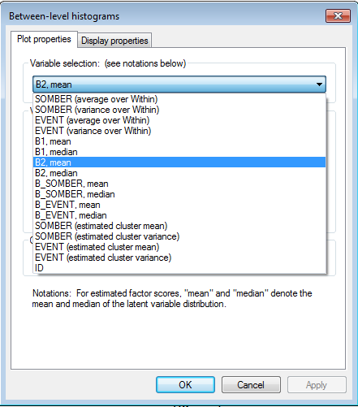{width="400px"}
  
Click "OK". This shows you the sample distribution of the autoregressive parameter. Note that the individual scores are based on the mean of an individual's posterior distribution for this parameter. 
</div>
  `r if(knitr::is_html_output()){"\\details"}`
</details>

* What is the highest and the lowest person-specific autoregressive effect?  

<details>
  <summary><b>Click to show answers</b></summary>
<div class="answer"> 
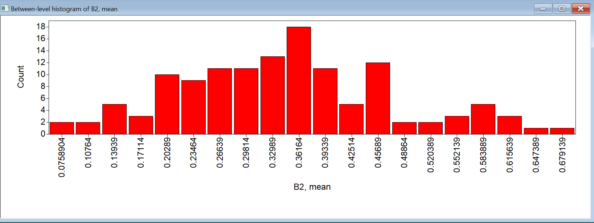{width="400px"}

The lowest is about 0.08 (so close to zero), the largest is about 0.7, so strong and positive. Most effects are around .2 to .45.
</div>
  `r if(knitr::is_html_output()){"\\details"}`
</details>
  
* Consider the level 2 effects where the within-person means of Somber are predicted by the within-person mean on Event, the random slope b1, and by the random slope b2. How would you interpret these results?  

<details>
  <summary><b>Click to show answers</b></summary>
<div class="answer"> 
```
Between Level
 SOMBER     ON
    B1                -2.342       1.403      0.037      -5.405       0.153
    B2                 0.181       0.626      0.377      -1.013       1.473
 SOMBER     ON
    EVENT             -0.831       0.183      0.000      -1.194      -0.476      *
```

Hence, only the person mean on Event is a significant predictor. The effect is negative, so people with relatively high person-specific means for 'pleasant Event' (report higher pleasant Event scores on average compared to others), tend to have relatively low person-specific means for Somber. 

While the effect of b1 was significant in a previous model, it no longer is in this model. 
</div>
  `r if(knitr::is_html_output()){"\\details"}`
</details>
  
## Dynamic SEM - including random autoregressive and cross-lagged effects.

Until now, we have treated Event as a predictor only. However, it is also possible that the experience of negative and positive Events is affected by a person's momentary somberness. Moreover, there may be an autoregressive effect for Events. Hence, we are interested in the following model:

{width="400px"}

Thus, we have added two random slopes to the model: `b3` and `b4`, the autoregressive and cross-lagged effect respectively. At the between level, we allow the now 6 random effects to be correlated, rather than that we predict one from the other as we did before. Note that while the figure does not include a relationship between S and E at t-1, these predictors are related in the model (as the model that is specified at time point t, equally applies to all other time points - so we could have added the same b1 arrow there); the current representation simply represents which model statements are needed.  

### Specify the Mplus Model 

How do you specify this model? Check your specification with the `model4.inp` input file.

<details>
  <summary><b>Click to show answers</b></summary>

<div class="answer"> 
```
MODEL:
            %WITHIN%
            s1 | Somber ON Event; ! lagged random regression
            s2 | Somber ON somber&1; ! random autoregression for somber
            s3 | Event ON Event&1; ! random autoregression for Event 
            s4 | Event ON somber&1; ! lagged regression from Somber to Event
            
            %BETWEEN%
            Somber Event s1 s2 s3 s4 WITH Event s1-s4;
```
</div>
	    
  `r if(knitr::is_html_output()){"\\details"}`
</details>

### Model Equations

* While running the model, write down the regression equation for the within level.

<details>
  <summary><b>Click to show answers</b></summary>
<div class="answer"> 
$$S^{(w)}_{it}=b_{1i}\times E^{(w)}_{it} + b_{2i}\times S^{(w)}_{it-1} + \zeta_{S it}$$

$$E^{(w)}_{it}=b_{3i}\times E^{(w)}_{it-1} + b_{4i}\times S^{(w)}_{it-1} + \zeta_{S it}$$
</div>
  `r if(knitr::is_html_output()){"\\details"}`
</details>


* In contrast to typical cross-lagged models that we covered in the lecture, we are not including a covariance between the residuals here. Why not?

<details>
  <summary><b>Click to show answers</b></summary>
<div class="answer"> 
The concurrent (lag 0) relationship is already accounted for by the (random) regression of $S_{it}$ on $E_{it}$. The residual of $S_{it}$ is the part that cannot be predicted from $E_{it}$ (and $S_{it-1}$); hence it would not make sense to correlate this residual with the residual of $E_{it}$. 
</div>
  `r if(knitr::is_html_output()){"\\details"}`
</details>


* How many parameters are estimated at each level?

<details>
  <summary><b>Click to show answers</b></summary>
<div class="answer"> 
Within: 2 residual variances

Note that because Event is now not only a predictor, but also an outcome, we no longer estimate its variance, but instead its <i>residual</i> variance; the variance of Event is now a function of the residual variance, the regression coefficients, and the variances of the predictors. 

Between: 

-	4 fixed slopes (mean slopes)
-	2 fixed intercepts (grand means)
-	6 variances of the 4 slopes and 2 intercepts (random effects)
-	15 covariances between these random effects

29 parameters in total.
</div>
  `r if(knitr::is_html_output()){"\\details"}`
</details>

### Convergence & Interpret the Results

When the model is finished, check the trace plots for signs of non-convergence. 

* Look at the estimated effects. What can you conclude about the autoregressive and cross-lagged coefficients?

<details>
  <summary><b>Click to show answers</b></summary>
<div class="answer"> 
```
Means
    B1               -0.169       0.014      0.000      -0.195      -0.142      *
    B2                 0.342       0.022      0.000       0.298       0.382      *
    B3                 0.118       0.020      0.000       0.078       0.159      *
    B4               -0.126       0.024      0.000      -0.176      -0.081      *
```

All of the average coefficients differ from zero.

The average autoregressive coefficients, b2 and b3, are positive. So for on average, there is carryover from one moment to the next both for feelings of somberness and the experienced pleasantness of events.

The average Cross-lagged coefficients b1 and b4 are negative, implying: More positive Events tend to be followed by less somberness an occassion later, while increased somberness tends to by followed by less positively experienced events.  
</div>
  `r if(knitr::is_html_output()){"\\details"}`
</details>

* To compare the strengths of the cross-lagged effects, we need to consider the standardized parameters. Check the standardized output, and interpret the regression coefficients there. 

<details>
  <summary><b>Click to show answers</b></summary>
<div class="answer"> 

```
B1 | SOMBER ON
    EVENT             -0.211       0.013      0.000      -0.237      -0.187      *

 B2 | SOMBER ON
    SOMBER&1           0.341       0.014      0.000       0.312       0.370      *

 B3 | EVENT ON
    EVENT&1            0.119       0.015      0.000       0.091       0.149      *

 B4 | EVENT ON
    SOMBER&1          -0.105       0.015      0.000      -0.137      -0.077      *
```

The standardized autoregressive parameters should be (approximately) the same as the unstandardized ones. The reason for this is that the variances for $y_{t}$ and $y_{t-1}$ in a stationary model are the same by definition. Slight differences in the point estimates might occur due to the calculation procedure of the standardized effects. 

Note however that the standard errors are smaller for the standardized fixed effects. This is because the standardized fixed effect is a <i>sample mean</i> of the person-specific effects, and disregards sampling variability. Significance of fixed effects should hence be based on the <i>unstandardized</i> fixed effects. This also applies to the fixed cross-lagged effects. This is not an issue for the person-specific standardized effects.

The standardized average (fixed) effect from Event to Somber (-.211) is twice the size of the one from Somber to Event (-.105); so on average, the effect from Events on mood is stronger than the other way around. This however may be different from person to person.
</div>

  `r if(knitr::is_html_output()){"\\details"}`
</details>


* Consider the R-square output as well. How can you interpret this?

<details>
  <summary><b>Click to show answers</b></summary>
<div class="answer"> 
```
Within-Level R-Square Averaged Across Clusters
                                Posterior  One-Tailed         95% C.I.
    Variable        Estimate       S.D.      P-Value   Lower 2.5%  Upper 2.5%
    SOMBER          0.227       0.012      0.000       0.204       0.250
    EVENT           0.057       0.008      0.000       0.043       0.073
```

On average, 23% of within-person variability in Somber can be accounted for by the lagged relationships; for Event this is 6%. These numbers may however differ from person to person.

</div>
  `r if(knitr::is_html_output()){"\\details"}`
</details>


* Consider the covariances and correlations between the random effects. For which of these correlations is there evidence that they deviate from zero?

<details>
  <summary><b>Click to show answers</b></summary>
<div class="answer"> 
There are a few significant correlations:

```
SOMBER   WITH
    B1                -0.346       0.132      0.007      -0.585      -0.071      *
    B3                 0.342       0.151      0.017       0.027       0.623      *

B3       WITH
    B4                 0.571       0.198      0.011       0.102       0.865      *

 SOMBER   WITH
    EVENT             -0.523       0.083      0.000      -0.663      -0.346      *
```
People with relatively high person-specific means for somber tend to have  relatively low values for the effect of event on somber; and relatively high autoregressive effects for Event.

People with relatively higher autoregressive effects for Event tend to have relatively high values for the cross-lagged effect of somber on event.

People with relatively high person-specific means for somber tend to have relatively low person-specific means for event.

To interpret these effects further, we'll look at some plots in the following exercise.
</div>

  `r if(knitr::is_html_output()){"\\details"}`
</details>


* For each of these correlations, get a scatter plot and interpret the result (use the "Between-level scatterplots" option). 

<details>
  <summary><b>Click to show answers</b></summary>
<div class="answer"> 
Somber with b1: A higher mean level for Somber is related to lower b1 (effect of Event on Somber), which is negative on average; hence people with a lower level on somber, tend to have a b1 closer to zero, while individuals with a higher level on Somber tend to have a b1 that is more negative.

Somber with b3: Individuals with relatively high person-specific means of Somber tend to have relatively high positive autoregressive effects in their Events.

b3 with b4: People with relatively higher autoregressive effects for Event (b3) tend to have a relatively high b4 - Since the average b4 is negative, it means: higher autoregression for Event is a b4 closer to zero, while a lower autoregression for Event is associated with a stronger negative effect of Somber on Event. 

People with relatively high person-specific means for somber tend to have relatively low person-specific means for event.
</div>
  `r if(knitr::is_html_output()){"\\details"}`
</details>


## Bonus: Dynamic SEM - adding an implicit lag 2 effect.

As mentioned before, due to the time interval that the variable Event is referring to, you can think of this as a variable that is situated in time between two consecutive measurements of somber. Hence the lag 0 regression (b1) is in a way already a lagged relationship, and we have therefore not included the regression of Somber at occasion t on Event at occasion t-1, but only a "concurrent" relationship of Somber t on Event t (and hence no residual correlation between the residuals of somber t and event t). However, we could add the lagged effects to the model, which would than imply an implicit 'lag 2' effect. We then get the following model:


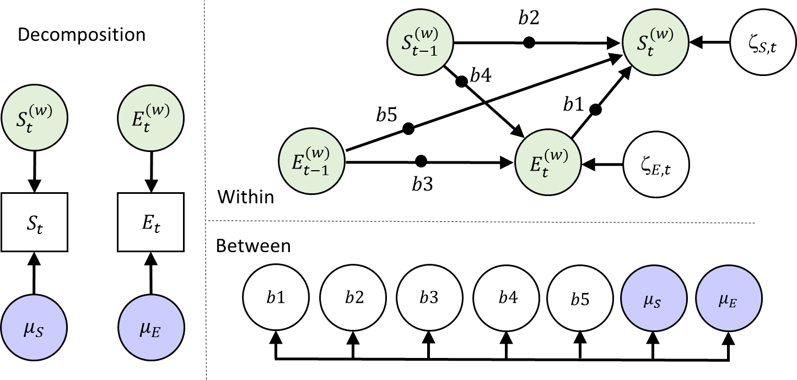{width="400px"}

### Additional parameters

How many additional parameters does this model have in comparison to the previous one?

<details>
  <summary><b>Click to show answers</b></summary>
<div class="answer"> 
The mean (fixed effect) of B5 and its variance (random effect) and the covariance between this random effect and the other 6 random effects; so 8 additional parameters.   
</div>
  `r if(knitr::is_html_output()){"\\details"}`
</details>


### Run the Mplus Model & Interpret the Results

Run this model, and interpret the results for the fixed effects of the lagged parameters. 

<details>
  <summary><b>Click to show answers</b></summary>
<div class="answer"> 
```
Means
    B1                -0.162       0.014      0.000      -0.190      -0.135      *
    B2                 0.324       0.022      0.000       0.279       0.367      *
    B3                 0.116       0.021      0.000       0.076       0.156      *
    B4                -0.131       0.025      0.000      -0.182      -0.083      *
    B5                -0.056       0.013      0.000      -0.080      -0.029      *
```

They all differ significantly from zero. 

The autoregressive parameters (b2 and b3) are positive.

The cross-lagged relationships are all negative. 

The new lagged effect (b5: delayed effect of Event on somber) is also negative; however, it is less strong than the other effect of Event on Somber (b1). 

</div>

  `r if(knitr::is_html_output()){"\\details"}`
</details>

## Bonus: Dynamic SEM - adding a between level factor structure.

Instead of simply correlating the random effects at the between level, we may also consider modeling these variables more explicitly. For instance, we can specify a factor model to try to capture what these level 2 variables have in common. This can be represented like this:

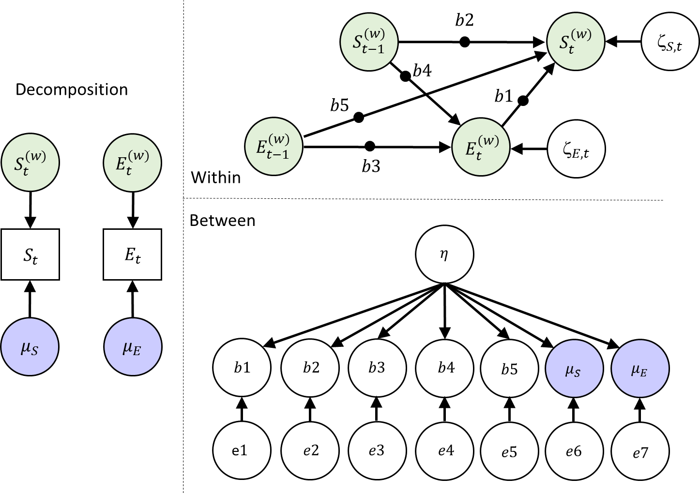{width="400px"}

How many parameters does this model have at each level?

<details>
  <summary><b>Click to show answers</b></summary>
<div class="answer"> 
Within: 2 residual variances

Between: 

- 7 residual variances for the indicators
- 6 factor loadings (one is fixed to 1 for scaling the latent variable)
- 1 latent variance for eta (mean of zero)
- 7 intercepts (means) for the indicators
</div>
  `r if(knitr::is_html_output()){"\\details"}`
</details>

### Specify the Mplus Model 

To specify the factor model at the between level, use:

```
              %BETWEEN%
              eta BY somber@1 Event b1*1 b2 b3 b4 b5;
```

(The `b1*1` is required in the Mplus v8.1; it is probably not necessary any more in a future version.)

* While running the model, indicate how you would interpret the factor $\eta$.

<details>
  <summary><b>Click to show answers</b></summary>
<div class="answer"> 
It is a latent variable which explains the shared variance among the random effects. Without further theory about what kind of latent variable would cause variation in all these random effects it is hard to give it a more meaningful label! Looking at the factor loadings may help interpret the factor here (akin to an EFA).
</div>
  `r if(knitr::is_html_output()){"\\details"}`
</details>

### Convergence & Interpret the Results

If the model converged, check the parameter estimates. Which factor loadings are significant, and what do they mean?


<details>
  <summary><b>Click to show answers</b></summary>
<div class="answer"> 
```
Between Level

 ETA      BY
    SOMBER             1.000       0.000      0.000       1.000       1.000
    EVENT             -0.529       0.257      0.000      -1.365      -0.271      *

 ETA      BY
    B1                -0.062       0.038      0.014      -0.158      -0.006      *
    B2                -0.016       0.055      0.353      -0.140       0.084
    B3                 0.095       0.058      0.020       0.005       0.249      *
    B4                 0.078       0.063      0.069      -0.025       0.240
    B5                -0.032       0.034      0.159      -0.111       0.031
```

People with higher eta tend to have:

-	Higher mean levels of somberness
-	Lower mean levels of unpleasant-pleasant Event
-	More negative effects of Event t on Somber t (b1) (more reactive to     events)
-	Higher carry-over in Event (b3) (more intertia in event)

Perhaps the latent variable could be called something like 'negative outlook' or 'neuroticism'. But it would be better to apply a model like this when one has a specific theory in mind!
</div>
  `r if(knitr::is_html_output()){"\\details"}`
</details>


## Bonus: Dynamic SEM - making the residual variance person-specific.

In this model, we allow the residual variances to be random. This is often not an option in multilevel software, but within the Bayesian approach of DSEM this is fairly doable. We do still assume normal distributions for the random effects, which is not 100% appropriate for variances as they should not be able to become negative. To avoid issues with this, we model logtransformed random variances instead. The model is depicted below - note that we have also kept the factor structure at the between level from exercise 6:

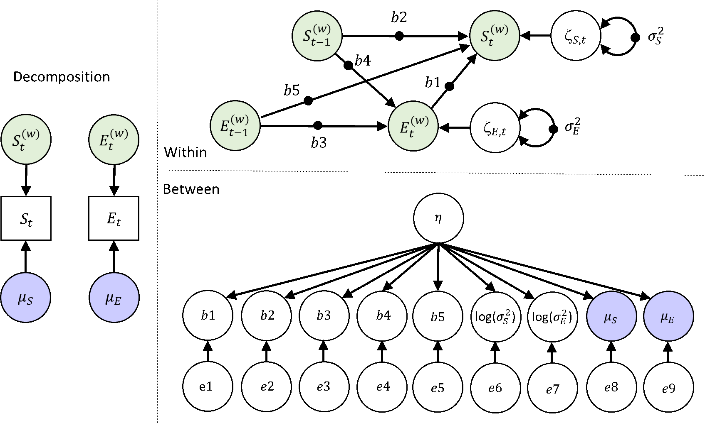{width="400px"}

### Specify the Mplus Model 

Specify this model (or sneak a peak at our input file) and run it. While it is running, determine the number of parameters that are estimated in this model.  

<details>
  <summary><b>Click to show answers</b></summary>
<div class="answer"> 
Within level: 0 parameters

Between level: 
-	9 fixed effects
-	9 variances
-	8 factor loadings
-	1 factor variance

27 parameters in total
</div>
  `r if(knitr::is_html_output()){"\\details"}`
</details>


### Convergence

Check the trace plots for signs of nonconvergence. Are there signs that indicate convergence may be slow?  

<details>
  <summary><b>Click to show answers</b></summary>
<div class="answer"> 
Some of the trace plots show there is a lot of autocorrelation in the Bayesian samples (iterations) over time. This means the chains 'mix' slowly - the two chains are not covering each other all the time, and only move slowly along the y-axis. 

However, the chains do vary around the same constant (which would be the posterior mean estimate).

Essentially, there is no evidence that the procedure is not converging, but that it is going relatively slowly. As a result, we'll need more iterations than if we have lower autocorrelations.

One could decide to increase the number of iterations. This can be done by simply increasing the iteration number, or by use the thin option here. When using `THIN=10`; Mplus saves only every tenth sample of the MCMC chain, and it also means that 10 times as many iterations are used. Thinning reduces (visible) autocorrelation in the chains, and as a result you can more easily see if the chains are mixing well.   

</div>
  `r if(knitr::is_html_output()){"\\details"}`
</details>

### Interpret the Results

* Consider the factor loading estimates: What do you conclude? 

<details>
  <summary><b>Click to show answers</b></summary>
<div class="answer"> 
```
Between Level

 ETA      BY
    SOMBER             1.000       0.000      0.000       1.000       1.000
    EVENT             -0.371       0.103      0.000      -0.595      -0.187      *

 ETA      BY
    B1                -0.088       0.024      0.000      -0.143      -0.047      *
    B2                 0.046       0.048      0.153      -0.039       0.147
    B3                 0.060       0.040      0.051      -0.012       0.144
    B4                -0.002       0.056      0.489      -0.115       0.105
    B5                -0.028       0.013      0.014      -0.055      -0.004      *
    LOGVS              1.412       0.403      0.000       0.856       2.448      *
    LOGVE              0.057       0.107      0.282      -0.132       0.289
```

B3 no longer loads significantly on $\eta$. 

People with relatively high scores on $\eta$, tend to have:

-	relatively high person-specific means for somberness
- relatively low person-specific means for event 
-	more negative effects of $Event_{t}$ on $Somber_{t}$ (b1)
-	more negative delayed effects of $Event_{t-1}$ on $Somber_{t}$ (b5)
-	Have a larger (log) residual variance for somberness
</div>
  `r if(knitr::is_html_output()){"\\details"}`
</details>

* Consider the R-square in the standardized results: What do you conclude?

<details>
  <summary><b>Click to show answers</b></summary>
<div class="answer"> 
Within: On average across persons, 24% of the within-person variance of momentary somberness and 5% of momentary Events is explained

Between: the factor eta accounts for a substantial proportion of between-person variability in average somberness (54%), direct reactivity (b1; 43%), and residual within-person variance in somberness (RVS; 45%). 

It accounts for a smaller proportion of variance in the average pleasantness of Events (22%) and delayed reactivity (b5; 20%).

The other R-squares are closer to zero.   
</div>
  `r if(knitr::is_html_output()){"\\details"}`
</details>

## Bonus: Dynamic SEM - Adding a level 2 (between level) predictor.

Finally, we consider a between level observed predictor for the nine random effects. For instance, we may consider a personality trait like Neuroticism as a useful predictor of individual differences in person-specific average somberness, and person-specific average experienced unpleasantness-pleasantness of events. Furthermore, we can investigate whether it predicts individual differences in inertia (autoregression), reactivity (cross-lagged regressions), and residual variances.    

{width="400px"}

### Specify the Mplus Model 

* Specify the model and run it. While it is running indicate how many parameters this model has.

<details>
  <summary><b>Click to show answers</b></summary>
<div class="answer"> 
Within level: 0 parameters

Between level: 

-	9 fixed effects
-	9 variances
-	9 regression coefficients
-	1 mean for the between level predictor N
-	1 variance for the between level predictor N

29 parameters in total (....but see the next exercise)
</div>
  `r if(knitr::is_html_output()){"\\details"}`
</details>

* Check the number of free parameters in the output (under model fit). Is this correct? If it is not correct, which parameter is added/deleted by default by Mplus?

<details>
  <summary><b>Click to show answers</b></summary>
<div class="answer"> 
It is 30 rather than 29. 

The additional parameter that is estimates is the covariance between the residuals of the mean Somber and mean Events at the between level. 
</div>
  `r if(knitr::is_html_output()){"\\details"}`
</details>


### Interpret the Results

Interpret the resulting parameter estimates - focus on the regression coefficients of the model that was estimated.

<details>
  <summary><b>Click to show answers</b></summary>
<div class="answer"> 
```
Between Level

 B1         ON
    NEUROTIC          -0.004       0.002      0.004      -0.008      -0.001      *

LOGVS      ON
    NEUROTIC           0.051       0.016      0.001       0.019       0.082      *

 SOMBER     ON
    NEUROTIC           0.056       0.011      0.000       0.035       0.077      *

 EVENT      ON
    NEUROTIC          -0.018       0.007      0.005      -0.032      -0.004      *
```
People that score relatively high on Neuroticism tend to have relatively: 

-	high person-specific means for Somber 
-	low person-specific means for Event (on average less pleasant momentary events)
-	stronger reactivity to Event (i.e., a more negative b1)
-	larger residual variance for the variable Somber (more unexplained momentary fluctuations for Somberness)
</div>

  `r if(knitr::is_html_output()){"\\details"}`
</details>

End of the exercises for Day 5.

